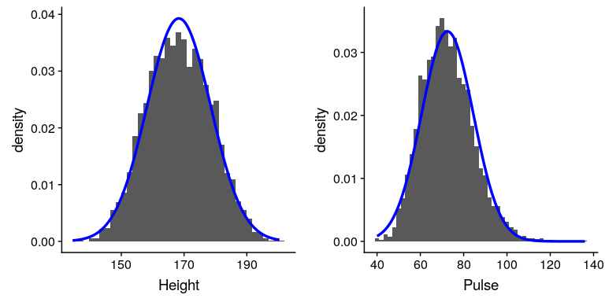

## 4.3 分布的理想化表示

数据集就像雪花，因为每一个都是不同的，但尽管如此，在不同类型的数据中经常会看到一些模式。这允许我们使用理想化的数据表示来进一步总结它们。让我们用[4.5](#fig:heightHistSep)中绘制的成人身高数据，并将它们与一个非常不同的变量一起绘制：脉率（每分钟心跳），也用 nhanes 测量（见图[4.6](#fig:NormalDistPlotsWithDist)）。

图 4.6 nhanes 数据集中高度（左）和脉冲（右）的柱状图，每个数据集中的正态分布重叠。

虽然这些情节看起来不完全相同，但都具有在中间圆顶上相对对称的一般特征。这个形状实际上是我们收集数据时常见的分布形状之一，我们称之为 _ 正态 _（或 _ 高斯 _）分布。该分布由两个值（我们称之为分布的 _ 参数 _）定义：中心峰的位置（我们称之为 _ 平均值 _）和分布的宽度（用称为 _ 标准偏差的参数描述）。操作 _）。图[4.6](#fig:NormalDistPlotsWithDist)显示了在每个历史程序顶部绘制的适当正态分布。您可以看到，虽然曲线不完全符合数据，但它们在描述分布方面做得很好——只有两个数字！

正如我们在后面的课程中讨论中心极限定理时所看到的，世界上许多变量呈现正态分布的形式有一个深刻的数学原因。

### 4.3.1 偏斜度

图[4.6](#fig:NormalDistPlotsWithDist)中的例子很好地遵循正态分布，但在许多情况下，数据将以系统的方式偏离正态分布。数据可以偏离的一种方式是不对称的，这样分布的一个尾部比另一个更加密集。我们称之为“歪斜”。偏度通常发生在测量被限制为非负值的情况下，例如我们计算事物或测量经过的时间（因此变量不能取负值）。

斜率的一个例子可以在旧金山国际机场机场安全线的平均等待时间中看到，在图 [4.7 的左侧面板](#fig:SFOWaitTimes)中绘制。您可以看到，虽然大多数等待时间不到 20 分钟，但有许多情况下，它们会更长，超过 60 分钟！这是一个“右偏”分布的例子，其中右尾比左尾长；在查看计数或测量时间时，这些是常见的，不能小于零。看到“左偏”分布不太常见，但它们可能发生，例如，当查看不能取大于 1 的值的分数值时。

图 4.7 右偏和长尾分布示例。左：从[https://awt.cbp.gov/](https://awt.cbp.gov/)获取的 SFO 终端 A 安全的平均等待时间（2017 年 1-10 月）。右图：从斯坦福大型网络数据库中获取的 3663 个人中 Facebook 好友数量的柱状图。朋友最多的人用蓝点表示。

### 4.3.2 长尾分布

历史上，统计数据主要集中在正态分布的数据上，但有许多数据类型看起来与正态分布完全不同。特别是，许多现实世界的分布是“长尾巴”，这意味着右尾巴远远超出了分布中最典型的成员。一种最有趣的数据类型，其中长尾分布发生在社会网络的分析。例如，让我们看看来自斯坦福大网络数据库[的 Facebook 好友数据，并绘制数据库中 3663 人的好友数量柱状图（参见图](https://snap.stanford.edu/data/egonets-Facebook.html)[4.7](#fig:SFOWaitTimes)的右面板）。如我们所见，这个分布有一个很长的右尾——一般人有 24.09 个朋友，而朋友最多的人（用蓝点表示）有 1043 个！

在现实世界中，长尾分布越来越被认可。特别是，复杂系统的许多特征都具有这些分布特征，从文本中的单词频率，到进出机场的航班数量，再到大脑网络的连接。有许多不同的方法可以实现长尾分布，但在基督教圣经中所谓的“马太效应”的情况下会出现一个常见的方法：

> 因为凡有更多的，必被赐给他，他也必富足；但没有的，连他所拥有的，也必被夺去。-马太福音 25:29，修订后的标准版

通常被解释为“富人越富有”。在这种情况下，优势是复合的，这样那些有更多朋友的人可以接触到更多的新朋友，而那些有更多钱的人可以做更多能增加他们财富的事情。

随着课程的发展，我们将看到一些长尾分布的例子，我们应该记住，当面对长尾数据时，统计中的许多工具可能会失败。正如纳西姆·尼古拉斯·塔勒布在其《黑天鹅》一书中指出的那样，这种长尾分布在 2008 年金融危机中起到了至关重要的作用，因为交易员使用的许多金融模型都假设金融系统将遵循正态分布，而他们显然没有遵循正态分布。