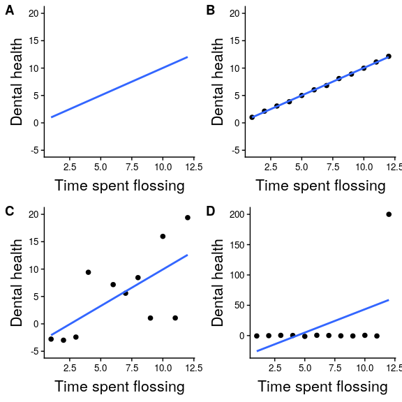

## 6.4 良好可视化原则

许多书都是关于数据的有效可视化的。有一些原则是大多数作者都同意的，而其他的则更具争议性。这里我们总结了一些主要原则；如果您想了解更多，那么在本章末尾的 _ 建议阅读 _ 部分列出了一些很好的资源。

下面是我们对数据可视化的一些重要原则的提炼。

### 6.4.1 展示数据并使其脱颖而出

假设我做了一项研究，研究了牙齿健康和使用牙线的时间之间的关系，我想把我的数据形象化。图[6.7](#fig:dentalFigs)显示了这些数据的四种可能的表示。

1.  在面板 A 中，我们实际上并不显示数据，只是一条表示数据之间关系的线。这显然不是最佳的，因为我们实际上看不到底层数据是什么样子的。

面板 B-D 显示了绘制实际数据的三种可能结果，其中每个绘图显示了可能生成数据的不同方式。

1.  如果我们看到面板 B 中的情节，我们可能会怀疑——真实数据很少会遵循如此精确的模式。

2.  另一方面，面板 C 中的数据看起来像真实的数据——它们显示了一种总体趋势，但是它们是混乱的，就像世界上通常的数据一样。

3.  面板 D 中的数据表明，两个变量之间的明显关系仅仅是由一个个体引起的，我们称之为 _ 离群值 _，因为它们远远超出了组内其他变量的模式。很明显，我们可能不想从由一个数据点驱动的效果得出很多结论。此图强调了为什么 _ 总是 _ 重要的原因，即在过于相信任何数据摘要之前查看原始数据。

图 6.7 牙齿健康示例的四种不同可能数据表示。散点图中的每个点表示数据集中的一个数据点，每个图中的线表示数据中的线性趋势。