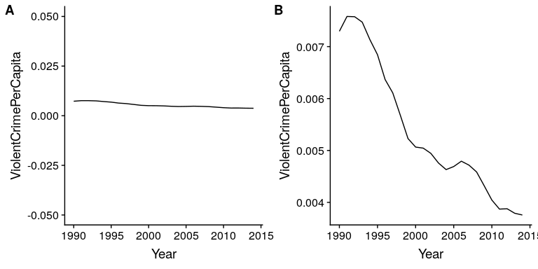
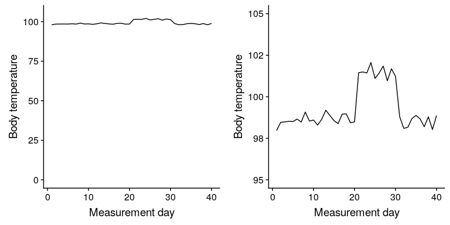

## 6.7 避免数据失真

通常可以使用可视化来扭曲数据集的消息。一个非常常见的方法是使用不同的轴缩放来放大或隐藏数据模式。例如，假设我们有兴趣看看美国的暴力犯罪率是否发生了变化。在图[6.10](#fig:crimePlotAxes)中，我们可以看到这些数据的绘制方式，要么使犯罪看起来保持不变，要么使犯罪率下降。相同的数据可以讲述两个截然不同的故事！

图 6.10 1990 年至 2014 年犯罪数据随时间的推移绘制。面板 A 和 B 显示相同的数据，但具有不同的轴范围。从[获取的数据 https://www.ucrdatatool.gov/search/crime/state/runcrimestatebystate.cfm](https://www.ucrdatatool.gov/Search/Crime/State/RunCrimeStatebyState.cfm)

统计数据可视化中的一个主要争议是如何选择 Y 轴，尤其是它是否应该总是包含零。达雷尔·赫夫在他的著名著作《如何用统计数字撒谎》中强烈主张，在 Y 轴上应该始终包括零点。另一方面，爱德华·塔夫特反对这一观点：

> “一般来说，在一个时间序列中，使用一个显示数据而不是零点的基线；不要花费大量的空白垂直空间试图以隐藏数据行本身所发生的事情为代价达到零点。”（摘自[https://qz.com/418083/its-ok-not-to-start-your-y 轴-at-zero/](https://qz.com/418083/its-ok-not-to-start-your-y-axis-at-zero/)）

在某些情况下，使用零点毫无意义。假设我们有兴趣绘制一个人随时间变化的体温。在图[6.11](#fig:bodyTempAxis)中，我们绘制了 Y 轴上有零或无零的相同（模拟）数据。很明显，通过在 Y 轴（图 A）上绘制这些数据为零，我们在图中浪费了大量的空间，因为活人的体温永远不会降到零！通过包括零，我们也使得 21-30 天明显的温度跃升变得不那么明显。一般来说，我对于线图和散点图的倾向是使用图中的所有空间，除非零点真正重要到需要突出显示。

图 6.11 随时间变化的体温，在 Y 轴上绘制有或没有零点。