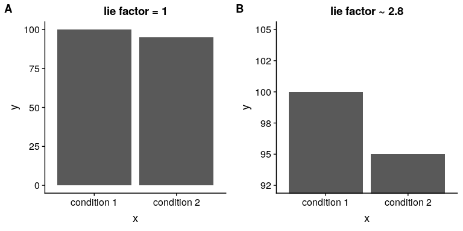

## 6.8 谎言因素

爱德华塔夫特引入了“谎言因素”的概念来描述可视化中的物理差异与数据差异大小的对应程度。如果图形的谎言因子接近 1，则它适当地表示数据，而谎言因子远离 1 则反映基础数据的失真。

谎言因素支持这样的论点：在许多情况下，一个人应该总是在条形图中包含零点。在图[6.12](#fig:barCharLieFactor)中，我们绘制了 Y 轴上有零和无零的相同数据。在面板 A 中，两条钢筋之间的面积比例差与值之间的比例差（即：Lie 系数=1）完全相同，而在面板 B（不包括零）中，两条钢筋之间的面积比例差大约是 2.8 倍于值的比例差异，因此它在视觉上夸大了差异的大小。

图 6.12 两个条形图及相关的测谎系数。