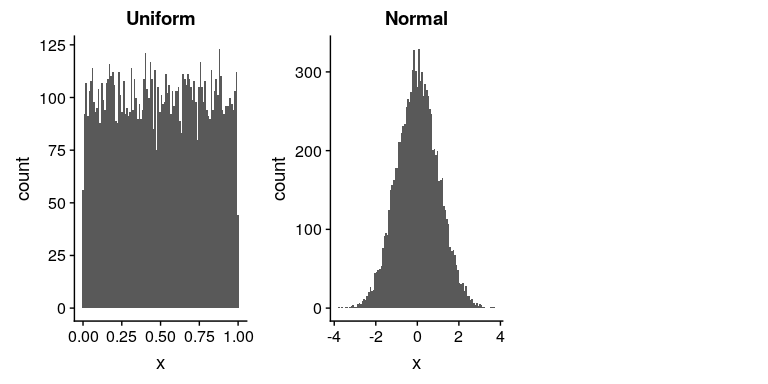

## 8.3 生成随机数

运行蒙特卡罗模拟需要我们生成随机数。只有通过物理过程才能生成真正的随机数（即完全不可预测的数），例如原子衰变或骰子滚动，这些过程很难获得和/或太慢，无法用于计算机模拟（尽管可以从[NIST 随机信标](https://www.nist.gov/programs-projects/nist-randomness-beacon%5D)）。

一般来说，我们使用计算机算法生成的 _ 伪随机 _ 数字来代替真正的随机数；从难以预测的意义上讲，这些数字看起来是随机的，但实际上这些数字序列在某一点上会重复出现。例如，R 中使用的随机数生成器将在个数之后重复。这远远超过了宇宙历史上的秒数，我们一般认为这对于统计分析的大多数目的来说都是好的。

在 R 中，有一个函数可以为每个主要概率分布生成随机数，例如：

*   `runif()`-均匀分布（0 和 1 之间的所有值相等）
*   `rnorm()`-正态分布
*   `rbinom()`-二项分布（如掷骰子、掷硬币）

图[8.1](#fig:rngExamples)显示了使用`runif()`和`rnorm()`函数生成的数字示例，这些函数使用以下代码生成：

```r
p1 <-
  tibble(
    x = runif(10000)
  ) %>% 
  ggplot((aes(x))) +
  geom_histogram(bins = 100) + 
  labs(title = "Uniform")

p2 <-
  tibble(
    x = rnorm(10000)
  ) %>% 
  ggplot(aes(x)) +
  geom_histogram(bins = 100) +
  labs(title = "Normal")

plot_grid(p1, p2, ncol = 3)
```



图 8.1 由均匀（左）或正态（右）分布生成的随机数示例。

如果您有一个 _ 分位数 _ 函数用于分发，您还可以为任何分发生成随机数。这是累积分布函数的倒数；分位数函数不是确定一组值的累积概率，而是确定一组累积概率的值。使用分位数函数，我们可以从均匀分布中生成随机数，然后通过它的分位数函数将其映射到兴趣分布中。

默认情况下，每次运行上面描述的随机数生成器函数之一时，R 都会生成一组不同的随机数。但是，通过将所谓的 _ 随机种子 _ 设置为特定值，也可以生成完全相同的随机数集。我们将在本书中的许多示例中这样做，以确保示例是可重复的。

```r
# if we run the rnorm() command twice, it will give us different sets of pseudorandom numbers each time
print(rnorm(n = 5))
```

```r
## [1]  1.48  0.18  0.21 -0.15 -1.72
```

```r
print(rnorm(n = 5))
```

```r
## [1] -0.691 -2.231  0.391  0.029 -0.647
```

```r
# if we set the random seed to the same value each time, then it will give us the same series of pseudorandom numbers each time.
set.seed(12345)
print(rnorm(n = 5))
```

```r
## [1]  0.59  0.71 -0.11 -0.45  0.61
```

```r
set.seed(12345)
print(rnorm(n = 5))
```

```r
## [1]  0.59  0.71 -0.11 -0.45  0.61
```