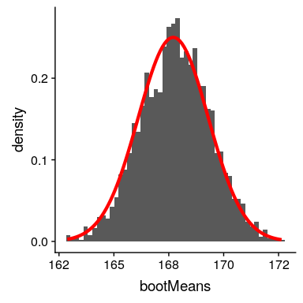

## 8.5 使用模拟统计：引导程序

到目前为止，我们已经使用模拟来演示统计原理，但是我们也可以使用模拟来回答实际的统计问题。在本节中，我们将介绍一个称为 _ 引导程序 _ 的概念，它允许我们使用模拟来量化统计估计的不确定性。在本课程的后面部分，我们将看到模拟通常如何用于回答统计问题的其他示例，特别是当理论统计方法不可用或假设过于令人窒息时。

### 8.5.1 计算引导程序

在上面的章节中，我们利用我们对平均值抽样分布的了解来计算平均值和置信区间的标准误差。但是如果我们不能假设这些估计是正态分布的，或者我们不知道它们的分布呢？引导的思想是使用数据本身来估计答案。这个名字来自于用自己的力量把自己拉起来的想法，表达了这样一个想法：我们没有任何外部的杠杆来源，所以我们必须依靠数据本身。自举方法是由斯坦福统计局的布拉德利·埃夫隆构想的，他是世界上最有影响力的统计学家之一。

引导背后的想法是，我们从实际的数据集中重复采样；重要的是，我们用替换的对 _ 进行采样，这样同一个数据点通常会在一个样本中被多次表示。然后我们计算每个引导样本的兴趣统计，并使用这些估计的分布。_

让我们从使用引导程序来估计平均值的采样分布开始，这样我们就可以将结果与前面讨论的平均值的标准误差（sem）进行比较。

```r
# perform the bootstrap to compute SEM and compare to parametric method

nRuns <- 2500
sampleSize <- 32

heightSample <- 
  NHANES_adult %>%
  sample_n(sampleSize)

bootMeanHeight <- function(df) {
  bootSample <- sample_n(df, dim(df)[1], replace = TRUE)
  return(mean(bootSample$Height))
}

bootMeans <- replicate(nRuns, bootMeanHeight(heightSample))

SEM_standard <- sd(heightSample$Height) / sqrt(sampleSize)
sprintf("SEM computed using sample SD: %f", SEM_standard)
```

```r
## [1] "SEM computed using sample SD: 1.595789"
```

```r
SEM_bootstrap <- sd(bootMeans)
sprintf("SEM computed using SD of bootstrap estimates: %f", SEM_bootstrap)
```

```r
## [1] "SEM computed using SD of bootstrap estimates: 1.586913"
```



图 8.4 计算平均值标准误差的引导示例。柱状图显示平均值在引导样本之间的分布，红线显示基于样本平均值和标准差的正态分布。

图[8.4](#fig:bootstrapSEM)显示，基于正态性假设，引导样本的平均值分布与理论估计值相当接近。我们也可以使用引导样本计算平均值的置信区间，只需从引导样本的分布计算感兴趣的分位数。

```r
# compute bootstrap confidence interval

bootCI <- quantile(bootMeans, c(0.025, 0.975))
pander("bootstrap confidence limits:")
```

自举置信限：

```r
pander(bootCI)
```

<colgroup><col style="width: 13%"> <col style="width: 13%"></colgroup> 
| 2.5% | 98% |
| --- | --- |
| 164.634 年 | 170.883 个 |

```r
# now let's compute the confidence intervals using the sample mean and SD
sampleMean <- mean(heightSample$Height)

normalCI <- 
  tibble(
  "2.5%" = sampleMean - 1.96 * SEM_standard,
  "97.5%" = sampleMean + 1.96 * SEM_standard
)

print("confidence limits based on sample SD and normal distribution:")
```

```r
## [1] "confidence limits based on sample SD and normal distribution:"
```

```r
pander(normalCI)
```

<colgroup><col style="width: 13%"> <col style="width: 13%"></colgroup> 
| 2.5% | 97.5% |
| --- | --- |
| 164.575 年 | 170.831 个 |

我们通常不会使用引导程序来计算平均值的置信区间（因为我们通常可以假设正态分布适合平均值的抽样分布，只要我们的样本足够大），但是这个例子显示了该方法如何粗略地给出结果与基于正态分布的标准方法相同。在我们知道或怀疑正态分布不合适的情况下，引导程序更常被用来为其他统计数据的估计生成标准错误。